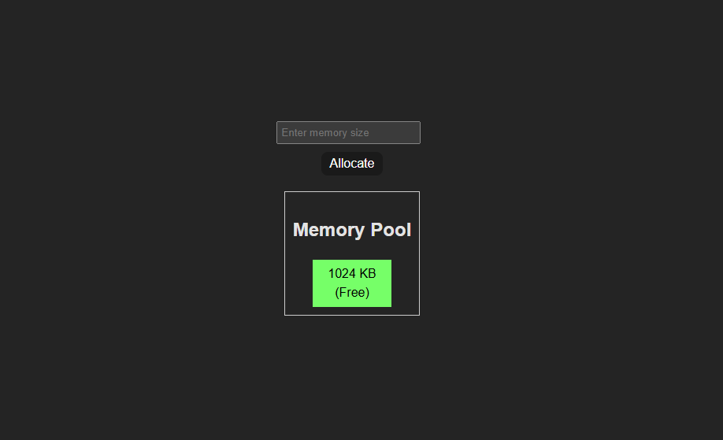

# React Buddy Memory Allocation Simulator

This project is a **Buddy Memory Allocation Simulator** implemented in **React.js**. It demonstrates a memory management algorithm using the **buddy system**, dynamically allocating, splitting, and merging memory blocks. The application includes a visual representation of the memory pool, showcasing allocated and free blocks.

---

## Features

- **Buddy System Implementation**: Allocates memory in blocks that are powers of two, splitting larger blocks as necessary.
- **Dynamic Memory Visualization**: Displays memory blocks as color-coded segments:
  - **Red**: Allocated blocks.
  - **Green**: Free blocks.
- **Auto-Merge**: Merges free buddy blocks of the same size when deallocated.
- **Time-Based Deallocation**: Frees memory blocks automatically after 50 seconds of allocation.

---

## Demo


*A screenshot of the memory pool with free and allocated blocks.*

---

## Installation Process

Follow these steps to set up and run the project locally:

### Prerequisites
Make sure you have the following installed on your system:
- **Node.js** (v14 or higher) and npm (Node Package Manager)
  - Download from [Node.js official website](https://nodejs.org/).

### Steps to Install and Run

1. **Clone the Repository**:
   ```bash
   git clone https://github.com/yourusername/react-buddy-memory-simulator.git
   cd react-buddy-memory-simulator
